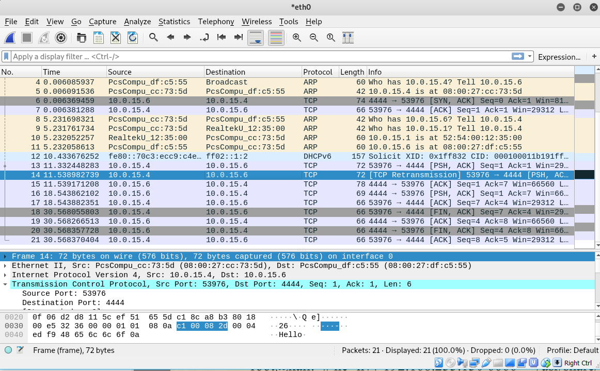
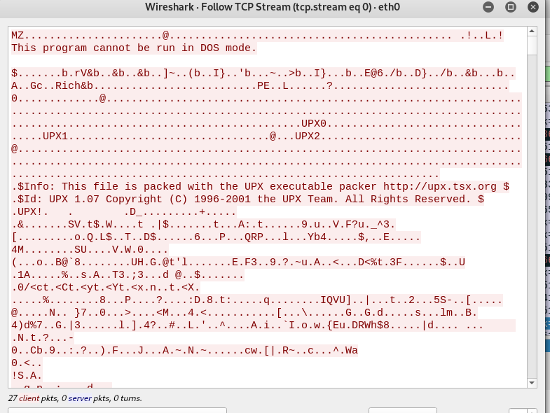
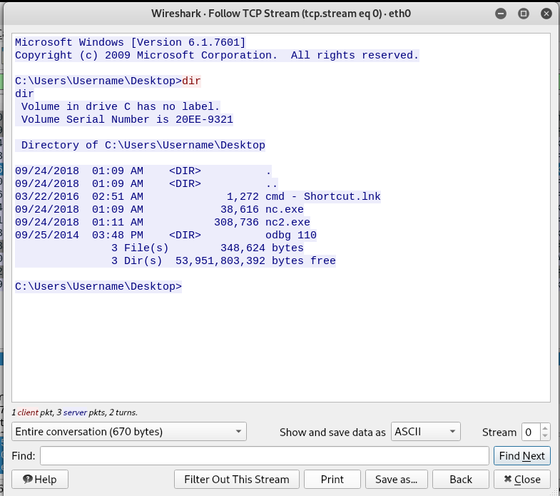
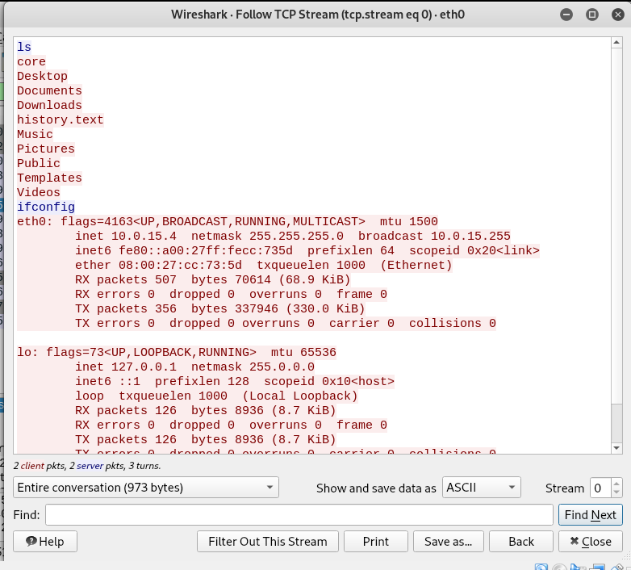
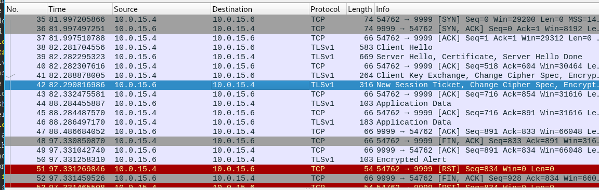
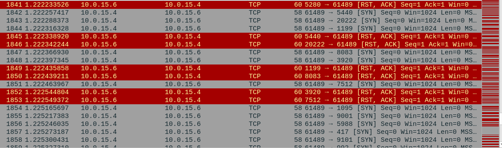
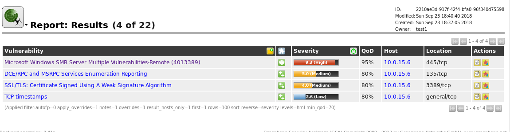
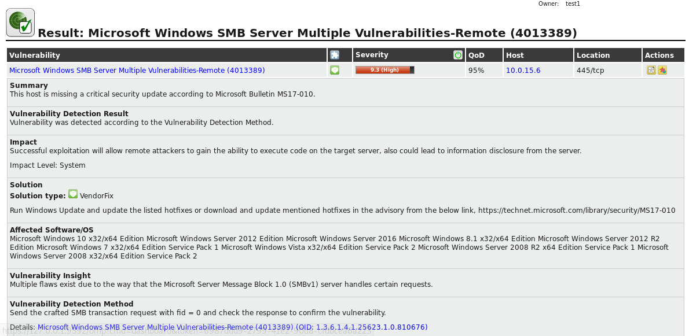

---
author:
- |
    Jurjen de Jonge\
    \
    Hogeschool van Amsterdam
title: Threat intelligence week 2
---

Netcat assignment
=================

Banner grabbing SSH
-------------------

Wireshark shows an TCP handshake, after the handshake has been completed
it shows the SSH protocol sending it's banner information towards the
Windows computer that executed the netcat command.

Setting up a chat relay
-----------------------

On windows the netcat will be listening to incoming connections on port
4444. After establishing the connection with netcat on the Kali linux
machine it shows that a connection has been made from the ip address of
the Kali linux machine (10.0.15.4) Then after typing Hello in the
terminal and hitting the enter key the message showed up at the Windows
machine. The same goes for when typing \"hi\" in the windows machine.

In Wireshark it first shows a handshake between the Kali and Windows
machine. Then the Kali machine sends the Hello message which gets
acknowledged by the Windows machine. The same scenario for the Hi
message from the Windows message towards the kali machine.

File transfer using netcat
--------------------------

After launching netcat on the Kali machine a large amount of TCP packets
appear in Wireshark. When following these packets in Wireshark it
becomes clear that there has been a transfer of a Windows executable by
the MZ keyword in the beginning. In windows it shows that a connection
has established from the Kali IP address\

Bind shell using netcat
-----------------------

In the Kali terminal a Windows CMD shell appears. It's possible to
execute commands on the Windows machine. Wireshark shows the command and
the text that is being transferred over the NC connection.

The pro about the bind shell is that the service is being hosted on the
machine it self, no need to ping a c&c or have a server that can be
taken down. The problem with it is that the machine needs to have a
exposed / non firewalled port that can be binded.\

Reverse shell using netcat
--------------------------

The command given in this part of the presentation seems off. I had to
add -e /bin/bash to the command to get the reverse shell working.\

After the reverse connection was made to the listing Windows machine I
could type ls to see a list of files and directories. In wireshark it
shows that the Linux machine is connecting to the Windows machine to
over the TCP protocol.\
\
The pro about a reverse shell is that the machine could be behind a
firewall and the attacker is still able to access that computer. A big
con is that there should always be a server listening to see if any
connections come in.

ncat for ssl encrypted shell
----------------------------

Using ncat it's possible to encrypt the shell using ssl. After setting
up the connection between Kali linux towards windows it and typing
\"ls\" in the CMD prompt it show the list of files and folders.\
But now looking at Wireshark it shows TLS traffic instead of plain text
transfer of the commands and responses.\
\
The pro's of using ncat is that it supports all the features of the
older netcat and extended that with SSL support. A con is that it
doesn't come by default on all \*unix machines. So the binary has to be
downloaded or locally compiled.

Nmap assignment
===============

Nmap scan of Windows computer
-----------------------------

It looks like a total of almost 100.000 bytes have been sent over the
network. This would surly be noticed if all the 65556 ports will be
scanned. The speed would still be quick if it would be a local network.
Over the internet it could take a lot of time to complete the full scan.
A lot of failed handshakes are visible in Wireshark.\

Network sweeping
----------------

The first scan uses an arp broadcast to get a list of active IP
addresses in the network.\
The second scan shows that nmap tries to establish a tcp connection on
port 80 which gets refused because the port is closed.\
Scans for the top 20 ports, can be seen in Wireshark. Again accessing
the ports using tcp.\
Version scanning generates a lot of traffic in Wireshark, you can see
that different protocols are being tested on different ports. If it
connects it tries to obtain information about the service.\
OS finger print scan performs again a large port scan and then behaves a
little funny to test what kind of operating system the scanned IP
address could be using. I've read that this is possible by looking at
the different time out between operating systems.\
The result of performing all scans was a lot of traffic compared to all
the other scans. Iptables told me that the scan was 221KB.This is huge
compared to the 100.000 bytes in the beginning.

OpenVAS scan
------------

The installation process of OpenVAS is easy on Kali linux. One high risk
vulnerability has been detected by OpenVAS. This was in the SMB server
of the Windows 7 installation. Multiple issues have been reported under
several CVE's. In the worst case scenario this could lead to remote code
execution (RCE)\
\
The High risk vulnerability explained\

